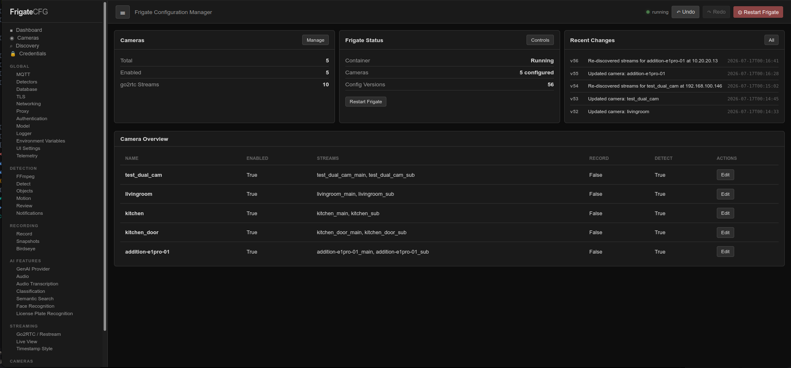
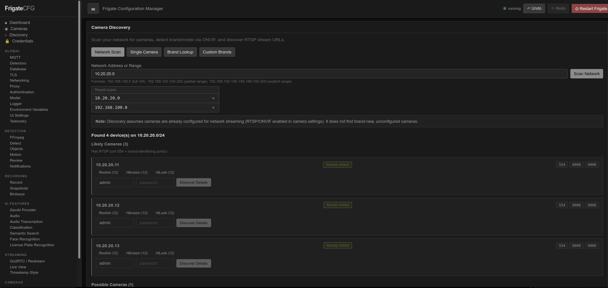
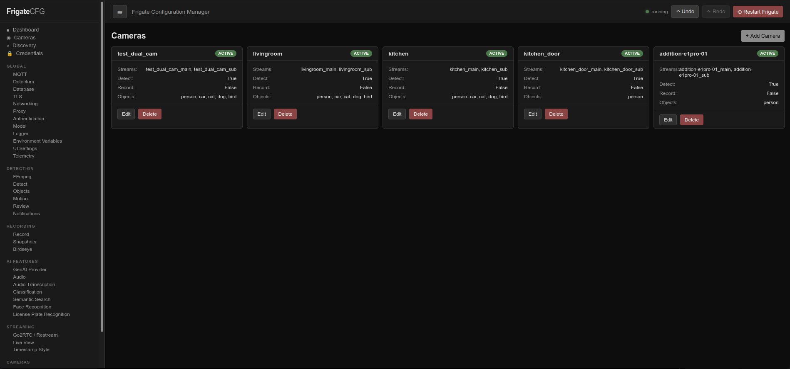
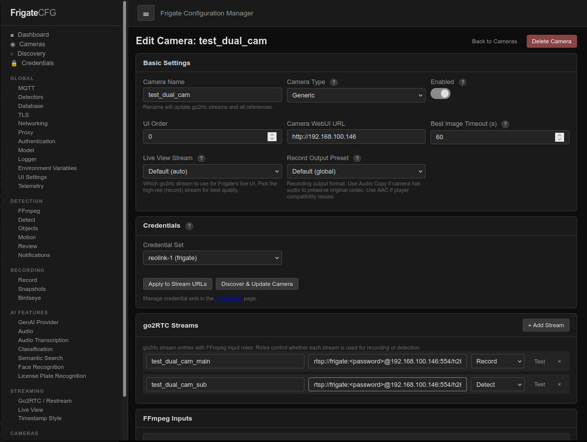
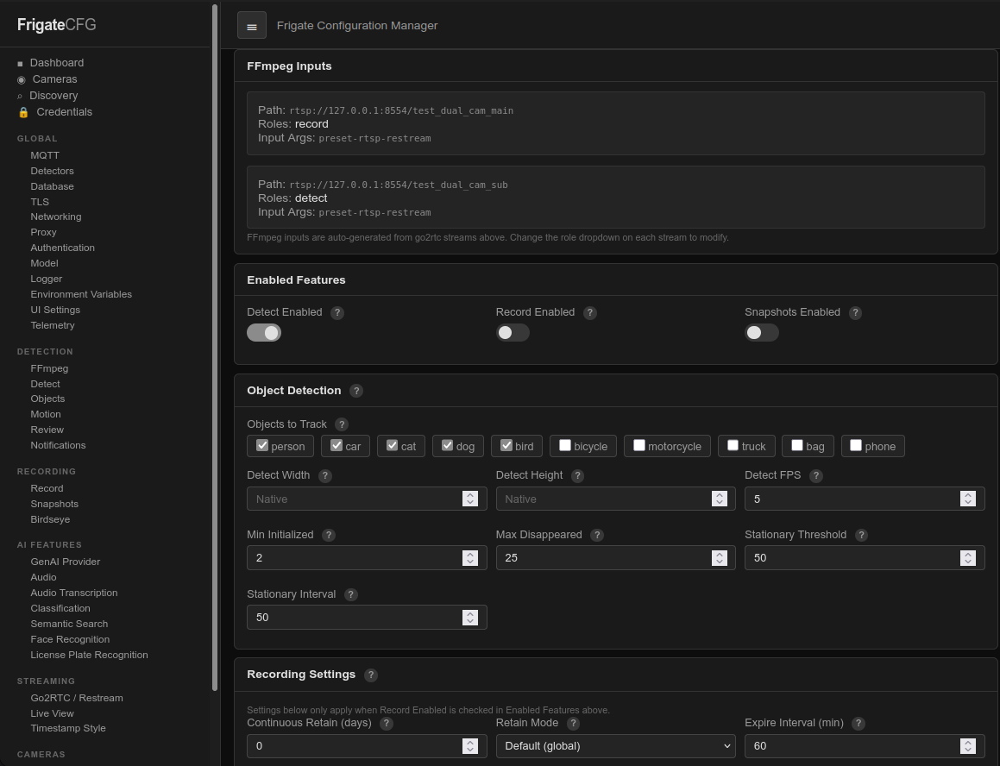
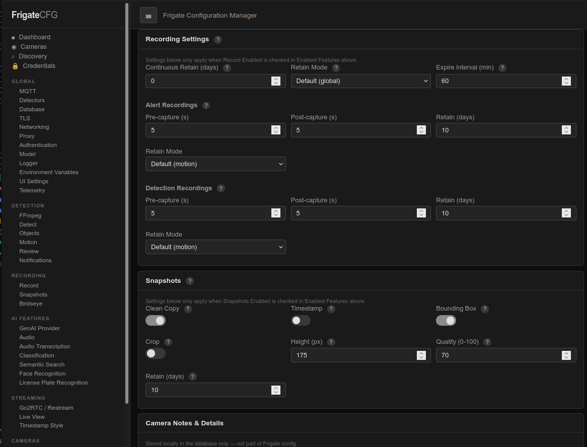

# Frigate Config Manager

A web-based configuration management UI for [Frigate](https://frigate.video/) — an open-source NVR with AI object detection.

Frigate Config Manager provides an easier interface to edit your Frigate `config.yml` without manually writing YAML. It manages cameras, streams, detectors, MQTT, notifications, and most all other Frigate config sections through form-driven editors.

I built this for my own use, but I'm sharing it in case it's useful for others. 

<table>
  <tr>
    <td>
      <a href="./images/dashboard.png"></a>
      <p align="center">Dashboard</p>
    </td>
    <td>
      <a href="./images/camera_discovery.png"></a>
      <p align="center">Camera Discovery</p>
    </td>
    <td>
      <a href="./images/camera_list.png"></a>
      <p align="center">Camera List</p>
    </td>
  </tr>
  <tr>
    <td>
      <a href="./images/edit_camera_1.png"></a>
      <p align="center">Edit Camera (1/3)</p>
    </td>
    <td>
      <a href="./images/edit_camera_2.png"></a>
      <p align="center">Edit Camera (2/3)</p>
    </td>
    <td>
      <a href="./images/edit_camera_3.png"></a>
      <p align="center">Edit Camera (3/3)</p>
    </td>
  </tr>
</table>
 
 
## Features

### Camera Management

- **Add / edit / delete / reorder** cameras via form-based UI
- **go2rtc stream management** — automatically links go2rtc streams to camera ffmpeg inputs
- **Camera metadata** — store notes, location, manufacturer, model, firmware version, serial number per camera (stored in SQLite, not Frigate config)
- **Per-stream RTSP testing** — verify each stream independently with ffprobe

### Camera Discovery

- **Network scan** — scan a /24 range for devices with camera ports open
- **Single camera discovery** — enter an IP + credentials, get full discovery results
- **ONVIF probing** — retrieve device info (manufacturer, model, firmware, serial), stream profiles (resolution, bitrate, FPS), and capabilities (PTZ, audio, analytics, imaging)
- **Stream URL suggestions** — brand-specific RTSP URL templates with credential substitution
- **Stream verification** — ffprobe-based testing of discovered streams
- **Custom brands** — add new brands or override existing ones (add ports, change URL templates)
- **One-click add from discovery** — add a discovered camera directly to your Frigate config with streams pre-configured

### Stored Credentials

- **Credential management page** — create, edit, and delete named credential sets (username/password pairs)
- **Environment variable loading** — credentials loaded from `.env` file on startup (e.g. `CREDENTIAL_USERNAME_REOLINK_1`, `CREDENTIAL_PASSWORD_REOLINK_1`)
- **Credential assignment per camera** — assign a stored credential set or enter manual credentials per camera
- **Apply credentials to streams** — inject username/password into all go2rtc stream URLs for a camera with one click
- **Credential update propagation** — updating a stored credential automatically updates stream URLs for all cameras using it

### Config Section Editors

- Form-driven editors for all Frigate config sections:
  - MQTT, Detectors, Database, TLS, Networking, Proxy, Authentication
  - Notifications, Birdseye, Audio, Record, Snapshots, Live
  - Motion, Objects, Zones, Camera Groups, Telemetry, Environment
- Schema-driven UI — fields, types, defaults, and descriptions defined in `config_schema.py`
- Dict collections (detectors, objects, zones) with add/remove key-value pairs

### Version History & Undo/Redo

- Every config save creates a versioned snapshot in SQLite
- **Undo/Redo** — revert or reapply changes at the section level
- **Version History** — view and restore any past config version
- Old config state stored per-section for precise undo

### Docker Integration

- **Restart Frigate** container directly from the UI after making changes
- **Live status** — Frigate container running/stopped indicator (auto-refreshing)
- Uses Docker socket mounted into the container

### UI / UX

- **HTMX** — dynamic content updates without full page reloads
- **SASS** — compiled to CSS at startup, dark theme
- **Responsive sidebar** layout with collapsible navigation
- **Live status indicators** and action feedback
- **Inline result feedback** — success/error messages for all async operations (stream tests, credential application, discovery)

## Quick Start

### Prerequisites

- Docker + Docker Compose
- A running Frigate container with a `config.yml`

> [!NOTE]  
> **Run frigatecfg in the same Docker Compose stack as Frigate.**
> For the best experience, both containers need access to the same `config.yml` file and the Docker socket. When they share the same compose file, frigatecfg can mount Frigate's config directory directly and restart the Frigate container via the Docker socket. Running them separately requires manual volume and socket configuration, and config file permissions may not match (e.g. Frigate runs as root, so frigatecfg must also have write access to the config file).
>
> Alternatively, you can run frigatecfg in a separate Docker Compose stack, export the configuration and paste it into frigates config editor, save it, then restart frigate.

### 1. Clone

```bash
git clone <repo-url> frigatecfg
cd frigatecfg
```

### 2. Configure

```bash
cp .env.example .env
# Edit .env to point FRIGATE_CONFIG_DIR at your Frigate config directory
# Optionally add stored credentials (see Stored Credentials below)
```

### 3. Run

```bash
docker compose up -d --build
```

The UI will be available at `http://localhost:8080`.

### Docker Compose

```yaml
services:
  frigatecfg:
    build: .
    container_name: frigatecfg
    ports:
      - "8080:8080"
    volumes:
      - ${FRIGATE_CONFIG_DIR:-../config}:/config
      - ./data:/app/data
      - /var/run/docker.sock:/var/run/docker.sock
    env_file:
      - .env
    environment:
      - FRIGATE_CONFIG_PATH=/config/config.yml
      - FRIGATE_CONTAINER_NAME=frigate
    restart: unless-stopped

  # Your existing or new Frigate container
  # ...
  frigate:
    image: ghcr.io/blakeblackshear/frigate:stable
    container_name: frigate
    # ... other Frigate config
```

### Environment Variables

| Variable                     | Default                       | Description                                       |
| ---------------------------- | ----------------------------- | ------------------------------------------------- |
| `FRIGATE_CONFIG_PATH`        | `/config/config.yml`          | Path to Frigate config YAML                       |
| `FRIGATE_CONTAINER_NAME`     | `frigate`                     | Docker container name for restart/status          |
| `FRIGATE_DOCKER_HOST`        | `unix:///var/run/docker.sock` | Docker socket path                                |
| `FRIGATE_CONFIG_DIR`         | `../config`                   | Host directory mounted as `/config` (compose var) |
| `SECRET_KEY`                 | `frigatecfg-dev-key`          | Flask secret key for sessions                     |
| `CREDENTIAL_USERNAME_<NAME>` | —                             | Stored credential username (loaded from `.env`)   |
| `CREDENTIAL_PASSWORD_<NAME>` | —                             | Stored credential password (loaded from `.env`)   |

### Stored Credentials via .env

Credentials can be pre-loaded on startup via environment variables in your `.env` file. The naming pattern is:

```
CREDENTIAL_USERNAME_REOLINK_1="frigate"
CREDENTIAL_PASSWORD_REOLINK_1="supersecret"
CREDENTIAL_USERNAME_OKAM="admin"
CREDENTIAL_PASSWORD_OKAM="88888888"
```

- `<NAME>` underscores become hyphens in the display name (e.g. `REOLINK_1` → `reolink-1`)
- Credentials are read-only in the UI when loaded from env; use the Credentials page to create additional sets
- Assign credential sets to cameras in the camera editor, or select them during single camera discovery

## Project Structure

```
frigatecfg/
├── docker-compose.yml          # Docker Compose service definition
├── Dockerfile                  # Container image (Python 3.12 + ffmpeg + docker CLI)
├── pyproject.toml              # Python project metadata + dependencies
├── .env.example                # Example environment file
├── src/frigatecfg/
│   ├── app.py                  # Flask app factory, SASS compilation, blueprint registration
│   ├── config_manager.py       # Load/save YAML, camera CRUD, stream linking, go2rtc sync, credential injection
│   ├── config_schema.py        # Schema definitions for all Frigate config sections
│   ├── docker_manager.py       # Docker restart, status, ffprobe RTSP testing
│   ├── models.py               # SQLite models: versions, undo/redo, camera metadata, custom brands, credentials
│   ├── brand_database.py       # 30+ camera brand definitions + custom brand merge logic
│   ├── camera_discovery.py     # Network scanning, ONVIF probing, stream verification
│   ├── routes/
│   │   ├── main.py             # Dashboard, version history
│   │   ├── cameras.py          # Camera CRUD, stream management, RTSP testing, credential application, rediscovery
│   │   ├── settings.py         # Global config section editors
│   │   ├── actions.py          # Restart Frigate, undo/redo, version restore
│   │   ├── credentials.py      # Credential CRUD, propagation to cameras
│   │   └── discovery.py        # Camera discovery, network scan, custom brand management
│   └── templates/
│       ├── base.html           # Base layout with sidebar nav + topbar
│       └── partials/           # HTMX partial templates for each view
├── static/
│   ├── sass/                   # SASS source files (compiled to CSS at startup)
│   │   ├── _variables.sass     # Theme colors, fonts, spacing
│   │   └── main.sass           # All application styles
│   └── js/app.js               # Client-side JS (stream testing, sidebar toggle, etc.)
```

## Dependencies

| Package           | Purpose                                                         |
| ----------------- | --------------------------------------------------------------- |
| Flask >= 3.0      | Web framework                                                   |
| PyYAML >= 6.0     | Frigate config YAML parsing                                     |
| libsass >= 0.23   | SASS → CSS compilation at startup                               |
| onvif-zeep >= 0.2 | ONVIF camera discovery (device info, stream URIs, capabilities) |
| requests >= 2.28  | HTTP requests for camera probing                                |

System packages (in Dockerfile):

- `ffmpeg` — provides `ffprobe` for RTSP stream verification
- `docker.io` — provides Docker CLI for Frigate container restart/status

## Development

### Local Setup

```bash
pip install -e ".[dev]"
python -m frigatecfg.app
```

### Linting

```bash
ruff check src/
```

## How It Works

### Config Flow

1. User edits config via UI → form submitted via HTMX POST
2. `config_manager.py` loads current `config.yml`, applies changes
3. Config saved to YAML file + version snapshot stored in SQLite
4. Undo entry pushed (old section state → new section state)
5. UI re-renders with updated state

### Camera ↔ go2rtc Linking

When a camera is added or edited, the config manager:

1. Creates/updates go2rtc stream entries (e.g. `front_door`, `front_door_sub`)
2. Auto-generates ffmpeg inputs pointing to `rtsp://127.0.0.1:8554/{stream_name}`
3. Assigns roles: `_sub` streams → `detect`, main streams → `record`
4. On rename/delete, updates all associated streams and ffmpeg input references

### Camera Discovery Flow

1. **Network scan**: TCP port scan across /24 range for camera-indicative ports (554, 8000, 8080, 8086, 9000, 10080, 10554, 37777, etc.)
2. **Brand detection**: Open ports matched against brand database (30+ brands with port signatures)
3. **ONVIF probe**: Device info, stream profiles, capabilities retrieved via ONVIF protocol
4. **Stream URL generation**: Brand-specific RTSP URL templates filled with IP + credentials
5. **Stream verification**: Each candidate URL tested with `ffprobe` (TCP transport) to confirm it's live
6. **One-click add**: Verified streams added to Frigate config with go2rtc entries + ffmpeg inputs auto-generated

### Credential Management Flow

1. Credentials stored in SQLite (created via UI) or loaded from `.env` on startup
2. Each camera can reference a credential set or use manual username/password
3. **Apply to Streams**: injects URL-encoded credentials into all go2rtc stream URLs for a camera
4. **Discover & Update**: runs full discovery using selected credentials, replaces streams + updates metadata
5. **Propagation**: updating a stored credential automatically updates stream URLs for all cameras using it

### Stream Testing

Uses `ffprobe` to perform a full RTSP handshake:

- DESCRIBE → verifies stream path exists
- Auth challenge → verifies credentials (401 = wrong password)
- Stream probe → extracts video codec, resolution, FPS, audio presence
- Falls back to TCP connect if ffprobe unavailable (with warning)
